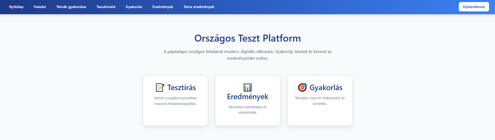
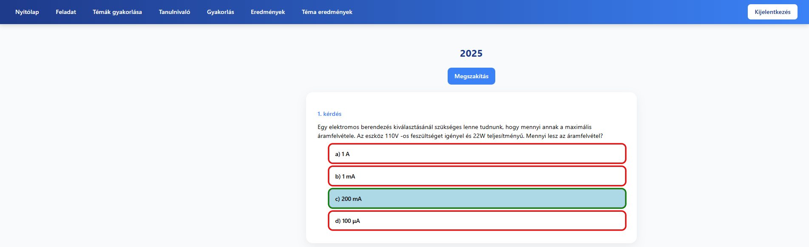
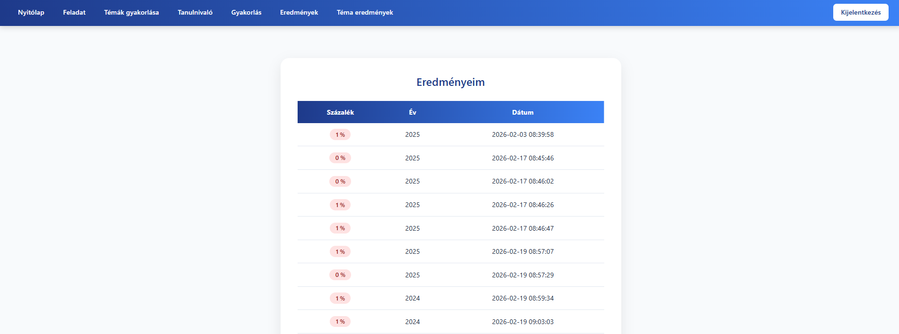
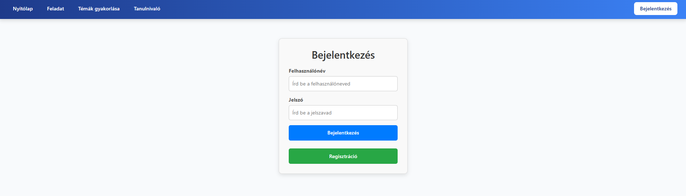
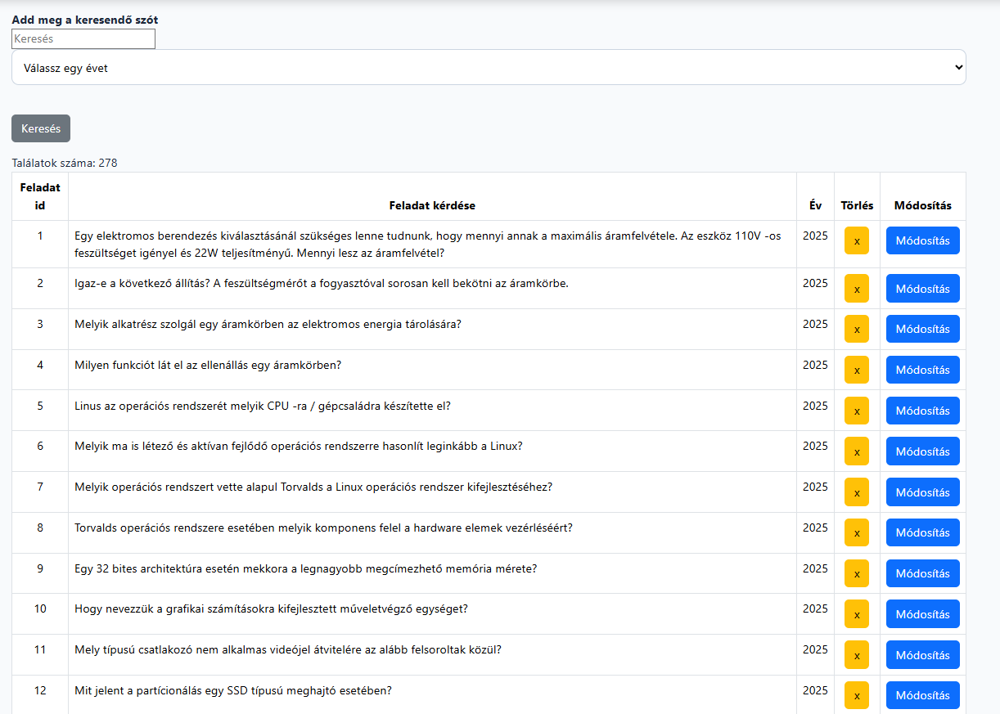

# 📱 OSZTV verseny Webalkalmazás

Ez a projekt egy OSZTV versenyt kezelő webalkalmazás, amely
záródolgozatként készült.
Az alkalmazás lehetővé teszi a diákok számára a versenyekre való felkészülést
és gyakorlást digitális formában.

A rendszer **frontend és backend architektúrával** készült.

------------------------------------------------------------------------

# 👨‍💻 Készítők

-   Pénzes Tibor
-   Karpács Boglárka

------------------------------------------------------------------------

# 🧰 Felhasznált technológiák

## Frontend

-   React
-   JavaScript
-   HTML
-   CSS

## Backend

-   Node.js
-   Express.js

## Adatbázis

-   MySQL

------------------------------------------------------------------------

# ⚙️ Funkciók

Az alkalmazás főbb funkciói:

-   🏆 Versenyek listázása
-   📊 Eredmények megtekintése
-   👤 Felhasználói regisztráció
-   🔐 Bejelentkezés
-   ➕ Pontok rögzítése
-   🗄️ Adatok tárolása MySQL adatbázisban

------------------------------------------------------------------------

# 🗂️ Projekt struktúra

    project-root
    │
    ├── frontend        # React alkalmazás
    │
    ├── backend         # Express szerver
    │
    ├── database        # SQL fájlok / adatbázis séma
    │
    └── README.md

------------------------------------------------------------------------

# 🚀 Telepítés és futtatás

## 1️⃣ Repository klónozása

    git clone https://github.com/Tibi011/Zarodolgozat.git

## 2️⃣ Backend telepítése és indítása

    npm install
    node backend.js

A backend alapértelmezetten a következő porton fut:

    http://localhost:3000

------------------------------------------------------------------------

## 3️⃣ Frontend telepítése és indítása

    npm install
    npm start

A frontend elérhető lesz:

    http://localhost:3001

------------------------------------------------------------------------

# 🗄️ Adatbázis beállítása

1.  Hozz létre egy új adatbázist MySQL-ben:

```{=html}
<!-- -->
```
    OSZTV verseny

2.  Importáld a `osztv_adatbazis.sql` fájlt.

3.  Állítsd be a backendben az adatbázis kapcsolatot.

Példa:

    const connection = mysql.createConnection({
      host: "localhost",
      user: "root",
      password: "",
      database: "osztv_adatbazis"
    });

------------------------------------------------------------------------

# 🔗 API végpontok (példa)

| Method | Endpoint          | Leírás                                   |
| ------ | ----------------- | ---------------------------------------- |
| GET    | /tema             | Feladatok kiírása téma szerint           |
| GET    | /mindenadat       | Feladatok kiírása év szerint             |
| POST   | /kerdesKeres      | Feladat keresése                         |
| POST   | /eredmenyKeres    | Eredmények kiiratása felhasználó alapján |
| POST   | /eredmenyFelvitel | Eredmények rögzítése                     |


------------------------------------------------------------------------

# 📸 Képernyőképek

    
    
    
    
    

------------------------------------------------------------------------

# 🎓 Projekt célja

A projekt célja egy teljes **webalkalmazás** létrehozása
volt, amely bemutatja:

-   frontend fejlesztést React segítségével
-   backend API készítését Express használatával
-   adatbázis kezelését MySQL segítségével

------------------------------------------------------------------------

# 📄 Licenc

Ez a projekt oktatási célból készült.
